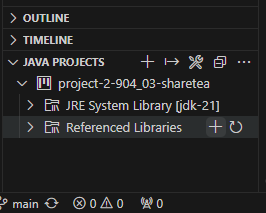
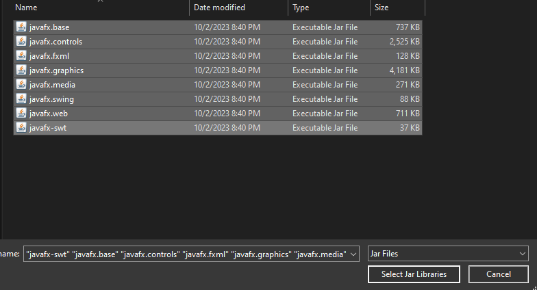
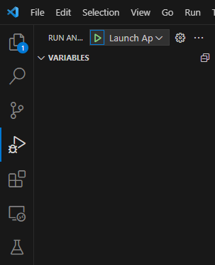

# Point of Sales System For Sharetea.

## User Interface

- The GUI allows the user to interact with the Point of Sale (POS) system to input and manage orders as well as manage the store inventory.
- To ensure that the GUI launches correctly, follow the steps below:

Go to `JAVA PROJECTS` view, find the `Referenced Libraries` node and click the `+` icon:

Go into the `lib` folder and choose either the `javafx-sdk-21-macos` folder or `javafx-sdk-21-windows` folder depending on your oprating system. Then navigate into `lib` of the
folder that you selected, select all of the JAR files and click `Select Jar Files`.

To launch the app, go to `Run and Debug` and click the green play button.

## SQL schema and Entities 
- The project defines a Point of Sale (POS) system for managing customer orders, employees, products, and inventory. In the entity-relationship structure, the primary entities are Customer, Employee, Order, OrderProduct, Product, InventoryProduct, and Inventory. Key relationships include a Customer placing multiple orders, each order being processed by one Employee, and orders comprising multiple products. An essential bridge entity is OrderProduct, connecting the many-to-many relationship between Order and Product. The InventoryProduct entity links available products with the actual inventory items.
- SQL schemas for each entity are provided, detailing columns, data types, and relationships. These schemas form the foundation for database creation and subsequent operations. This modular and scalable design ensures smooth addition of new records while preserving data integrity and representation. For a detailed view of the schemas and relationships, refer to the [SQL Documentation](docs/sqlp2.pdf)
